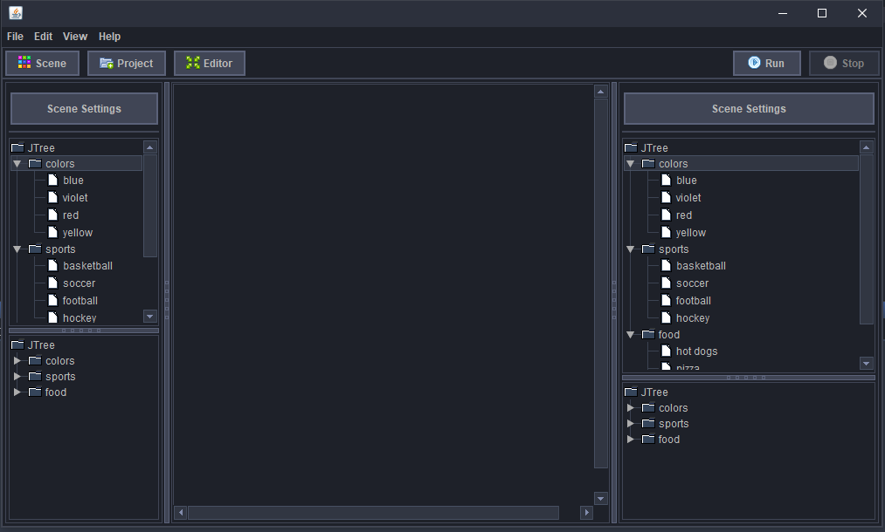
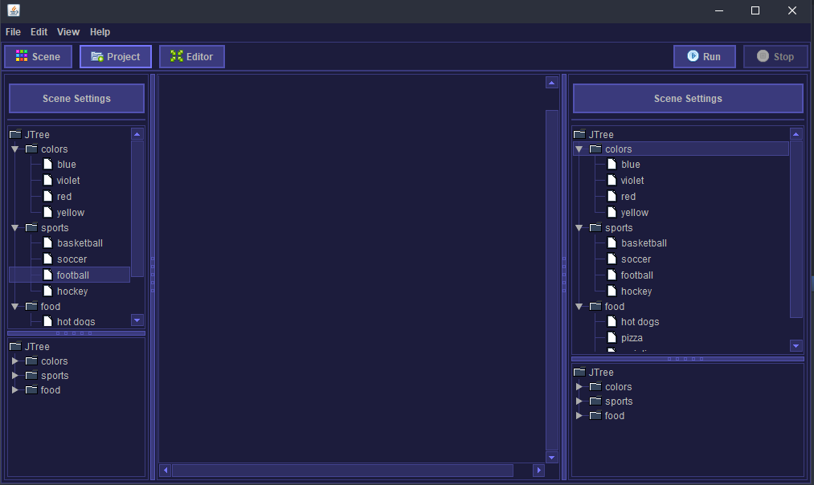

# ParadoxLAF
Paradox Look and feel for java swing!
Based on Darcula.




### How to use?
```java
        // Before creating a JFrame:
        try {
            UIManager.setLookAndFeel(ParadoxLaf.class.getCanonicalName());
            ParadoxLaf.setColor(new Color(120, 120, 255).darker().darker()); // Set custom theme color
        } catch (Exception e) {
            e.printStackTrace();
        }
        /*
         * Hint: 
         * ParadoxLaf.setColor(new Color(255, 120, 120).darker().darker());
         * Use jFrame.repaint(); if you want to dynamically change the theme
         */
```

